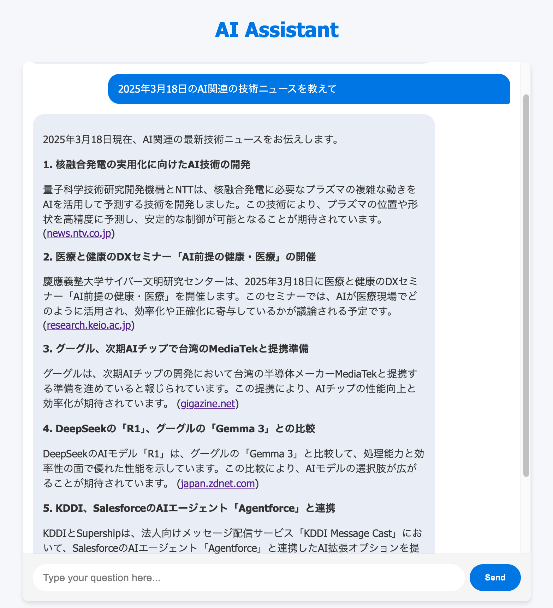

# AI Chat Assistant

A modern, simple chat UI powered by Flask, HTMX, and OpenAI Agent SDK that enables search and database query capabilities.



## Features

- Web search capabilities
- MySQL database integration and querying
- Markdown rendering with proper formatting
- Simple, modern chat interface
- Real-time response handling with HTMX
- Docker support for easy setup

## Setup

### Prerequisites

- Docker and Docker Compose
- OpenAI API key
- MySQL database (optional)

### Installation

1. Clone this repository
2. Set your OpenAI API key as an environment variable:

```bash
export OPENAI_API_KEY="your-openai-api-key"
# optional:
export DB_HOST="your-mysql-host"
export DB_USER="your-mysql-user"
export DB_PASSWORD="your-mysql-password"
export DB_DATABASE="your-mysql-database"
```

3. (Optional) Configure MySQL connection in environment variables:

```bash
export DB_HOST="your-mysql-host"
export DB_USER="your-mysql-user"
export DB_PASSWORD="your-mysql-password"
export DB_DATABASE="your-mysql-database"
```

4. Build and start the application:

```bash
docker-compose up --build
```

The application will be available at http://localhost:5001

## Usage

Simply open the application in your browser, type a question in the chat input, and press Send. The AI assistant will search the web for information and respond to your question.

### Database Queries

If MySQL is configured, you can ask questions about your database:
- "What tables are in the database?"
- "Show me the schema for table X"
- "Query data from table Y where column Z equals value"

The assistant will translate your questions into SQL queries and return the results.

## Development

To make changes to the application:

1. Modify the code as needed
2. Install required Python packages:

```bash
uv pip install -r requirements.txt
```

3. Restart the Docker container:

```bash
docker-compose restart
```

For hot-reloading during development, Flask's debug mode is enabled by default.

## Technologies Used

- Flask
- HTMX
- OpenAI Agent SDK
- MySQL Connector
- Python Markdown
- Docker
